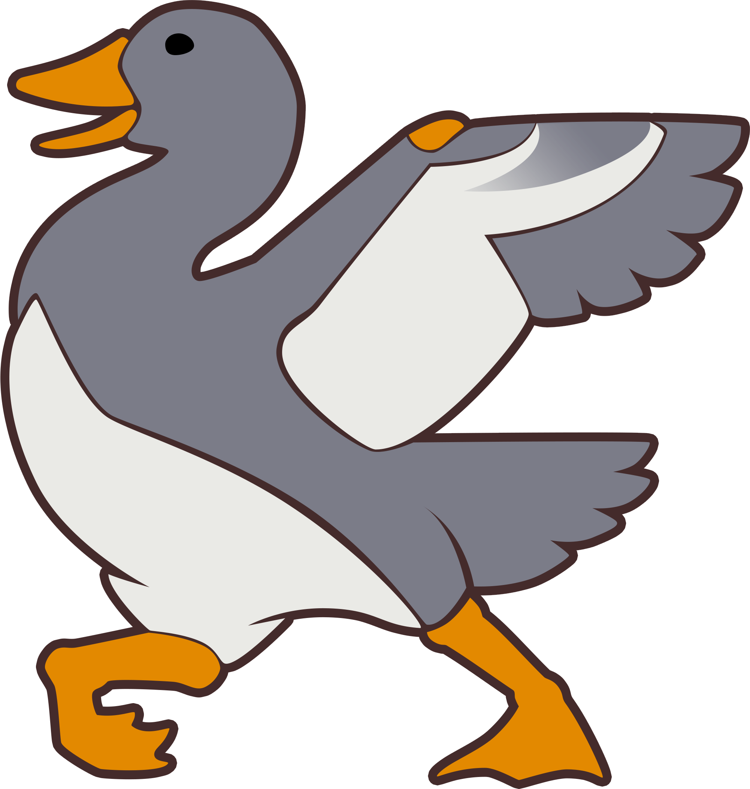

    
    <h1>dsda-doom</h1>
    <h3>A modern but conservative Doom source port</h3>

 

 

This is a successor of prboom+ with many new features, including:
- Heretic, Hexen, MBF21 and UDMF support
- In-game console and scripting
- Full controller support
- Palette-based opengl renderer
- Debugging features for testing
- Various quality of life improvements
- Strict mode for speedrunning
- Advanced tools for TASing
- Rewind

### Patch Notes
- [v0.29](./patch_notes/v0.29.md)
- [v0.28](./patch_notes/v0.28.md)
- [v0.27](./patch_notes/v0.27.md)
- [v0.26](./patch_notes/v0.26.md)

### Launcher
There is a dedicated launcher for this port available [dsda-launcher](https://github.com/Pedro-Beirao/dsda-launcher).

### Doom-in-Hexen Support
- [Full details](./docs/doom_in_hexen.md)

### UDMF Support
- [Full details](./docs/udmf.md)

### MAPINFO Support
- [Full details](./docs/mapinfo.md)

### Hexen Support
- DSDA-Doom includes demo-compatible support for hexen.
  - Use -iwad HEXEN.WAD (-file HEXDD.WAD for the expansion)
    - Or drag wads onto the exe
  - You can force hexen engine behaviour with `-hexen` (shouldn't be necessary)
- Don't need to supply complevel (hexen is complevel 0 by necessity)
- Known issues
  - Setting the "Status Bar and Menu Appearance" option to "not adjusted" will have no effect for hexen (it will default instead to "Doom format")
  - The "Apply multisampling" automap option is disabled for hexen
  - Automap colors are not configurable for hexen
  - Some of the more advanced features are not implemented for hexen yet, and using them may cause crashes or other odd behaviour.
  - Some menus extend over the hud.
  - Monster counter doesn't work as expected, due to cluster format (ex hud / levelstat)
  - Hexen-style skies aren't implemented yet (layering, etc)
  - The ALTSHADOW thing flag isn't affecting the rendering
  - Dynamic fade palettes aren't being used
  - The yellow message variant isn't implemented

### Heretic Support
- DSDA-Doom includes demo-compatible support for heretic (all the demos stored on dsda are in sync).
- Heretic game logic should be set automatically if you use `HERETIC.WAD` as the iwad. If it doesn't work, please use the `-heretic` commandline option. This flips a switch in the engine that determines all the core game data.
- Don't need to supply complevel (heretic is complevel 0 by necessity)
- Known issues
  - Setting the "Status Bar and Menu Appearance" option to "not adjusted" will have no effect for heretic (it will default instead to "Doom format").
  - The "Apply multisampling" automap option is disabled for heretic.
  - Automap colors are not configurable for heretic.
  - Some of the more advanced features are not implemented for heretic yet, and using them may cause crashes or other odd behaviour.
  - Dehacked support for heretic isn't implemented yet.
  - Some menus extend over the hud.

### Other Standards
- [MBF21 v1.4](https://github.com/kraflab/mbf21)
- [UMAPINFO v2.2](https://github.com/kraflab/umapinfo)

### Maintainers
- @fabiangreffrath, @rfomin, and @Pedro-Beirao 2024-
- @kraflab 2020-2024

### Credits
- The DSDA-Doom icon was designed by Mal (129thVisplane). Thanks!
